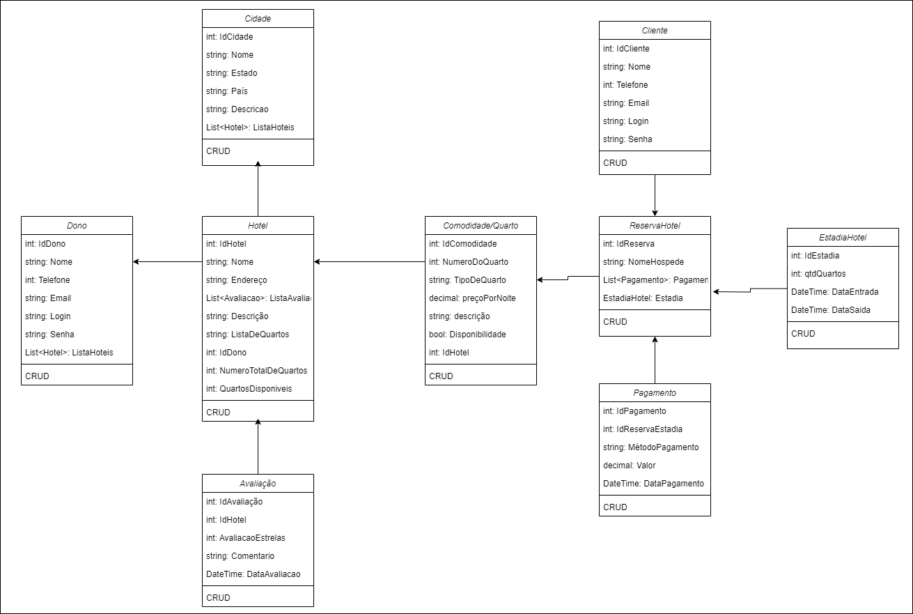

<h1 align='center'>
    
Projeto back-end - Reserva de quartos de hotéis

</h1>

## 🙋‍♂️ Equipe de desenvolvedores
- 
Felipe Franco Pinheiro

- 
Yang Soares Candido de Souza

- 
Yann Lucas Saito da Luz

- 
ChatGPT

## 📘 Sobre

O projeto se trata de um sistema de reservas de hotel que utilize uma Web API para verificar a disponibilidade de quartos e fazer reservas.

## Models:

- `Avaliacao` : Representa informações sobre avaliações.
- `Cidade`: Representa informações gerais sobre a cidade.
- `Cliente`: Representa informações sobre o cliente.
- `Comodidade`: Representa informações sobre a comodidade.
- `Dono`: Representa informações sobre o dono.
- `EstadiaHotel`: Representa informações a estadia do cliente.
- `Hotel`: Representa informações gerais sobre o Hotel.
- `ReservaHotel`: Representa informações sobre a reserva.
- `Pagamento`: Representa informações sobre o pagamento.

## Controllers:

- `AvaliacaoController` : Permite cadastrar, listar, buscar, alterar e excluir informações de Avaliacao.
- `CidadeController`: Permite cadastrar, listar, buscar, alterar e excluir informações de Cidade.
- `ClienteController`: Permite cadastrar, listar, buscar, alterar e excluir informações de Cliente.
- `ComodidadeController`: Permite cadastrar, listar, buscar, alterar e excluir informações de Comodidade.
- `DonoController`: Permite cadastrar, listar, buscar, alterar e excluir informações de Dono.
- `EstadiaHotelController`: Permite cadastrar, listar, buscar, alterar e excluir informações de EstadiaHotel.
- `HotelController`:Permite cadastrar, listar, buscar, alterar e excluir informações de Hotel.
- `ReservaHotelController`: Permite cadastrar, listar, buscar, alterar e excluir informações de ReservaHotel.
- `PagamentoController`: Permite cadastrar, listar, buscar, alterar e excluir informações de Págamento.

## Banco de Dados:

- `HotelDbContext` : Interação com o banco de dados.

## Funções:

O projeto, por meio de CRUDS, nos permite cadastrar, listar, buscar, alterar e excluir informações de todas as tabelas por meio da interface SWAGGER.

## Utilização do ChatGPT

Utilizamos o ChatGpt para a criação de duas classes do nosso projeto: Hotel e Comodidade. Para a criação das Models e Controllers, seguimos os exemplos apresentados em aula. Para isso, nós fornecemos um exemlo de Model e Controller de uma classe feita por nós e passamos o contexto da nossa aplicação, o que contribuiu para que o ChatGPT conseguisse gerar as Models e Controlles seguindo o padrão que optamos seguir durante o desenvolvimento do nosso projeto.

## Diagrama de classes:

